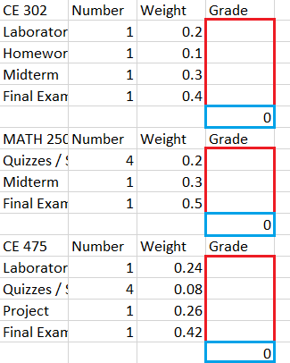

# IEU-Grade-Calculator-Excel

I made an automatic grade calculator maker (?), so you (and also me) don't have to check for every 
single course page for the evaluation metrics to prepare a basic Excel worksheet.


## How to Use?

You have to run the Python script [GradeCalculation.py](GradeCalculation.py) file, since I haven't
actually provided an executable file.

You also have to install the libraries that I've written in [requirements.txt](requirements.txt).

Once you are ready, you will see this code segment in the script.
```
67  if __name__ == '__main__':
68     asyncio.set_event_loop_policy(asyncio.WindowsSelectorEventLoopPolicy())
69     course_names = ['CE 302', 'MATH 250', 'CE 475', 'CE 306', 'ENG 310']
70 
71     ct = CourseTable(course_names)
72     ct.to_excel('grades.xlsx')
```
You can change the contents of the course_names list on line 69 to be whatever course you are taking.
You can also optionally change the output path of the Excel file on line 72, but it's not really necessary.

After the execution is done, your grades.xlsx will look like something this.



You can insert your grades to the corresponding cells (marked in red) and your course grade will be 
calculated on the cell just below them (marked in blue).

That's literally it. Have fun.
